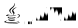

# Gonzalo Cabezas Núñez

<p align="center">
    <em>Fullstack Web Developer • Cybersecurity Enthusiast • Clean Code Advocate</em>
</p>

<h2 align="center">Frontend</h2>
<div align="center">
    
    
    
</div>

<h2 align="center">Backend</h2>
<div align="center">
    
    
    
    
</div>

<h2 align="center">Data / Formats</h2>
<div align="center">
    
    
</div>

<h2 align="center">Databases</h2>
<div align="center">
    
    
</div>

<h2 align="center">Infrastructure / Server</h2>
<div align="center">
    
</div>

---

## 🇬🇧 `FULLSTACK` WEB DEVELOPER

I’m passionate with clean, functional code. I train every day—both through formal courses and self-learning—because learning doesn’t stop when the bell rings. I like breaking things to understand (and fix) them better, which is why Red Teaming strongly appeals to me. I don’t follow the standard path; I prefer carving my own with a keyboard and coffee. I look for projects where I can learn, contribute, and leave a mark—without pretension or empty promises. If I don’t know something, I dig into it. And if something motivates me, I won’t stop until I get it right.

<div align="center">
    <!-- GH STATES -->
    
    <!-- TOP LANGS -->
    
</div>

### ⚖️ Licensing

>- 🖼️ SVG badges inside the `/skills/` directory are licensed under the [MIT](https://opensource.org/license/mit) License.
>- 👤 All other content in this repository is © [sandokan.cat](https://sandokan.cat). All rights reserved.

---

<details>
<summary>🇪🇸 Español</summary>

## DESARROLLADOR WEB `FULLSTACK`

Me apasiona el código limpio y funcional. Me formo a diario, tanto en academias como por libre, porque el conocimiento no se acaba cuando suena el timbre. Me gusta romper cosas para entenderlas (y arreglarlas mejor), por eso el Red Team me llama fuerte. No sigo el camino estándar; prefiero trazar el mío con teclado y café. Busco proyectos donde pueda aprender, aportar y dejar huella, sin postureos ni promesas vacías. Si algo no lo sé, lo investigo. Y si algo me motiva, no paro hasta hacerlo bien.

### ⚖️ Licencia

>- 🖼️ Los badges SVG dentro del directorio `/skills/` están licenciados bajo licencia [MIT](https://opensource.org/license/mit).
>- 👤 Todo el resto del contenido de este repositorio es © [sandokan.cat](https://sandokan.cat). Todos los derechos reservados.

</details>

---

<details>
<summary>🇦🇩 Català</summary>

## DESENVOLUPADOR WEB `FULLSTACK`

M'apassiona el codi net i funcional. Em formo a diari, tant en academies com per lliure, perquè el coneixement no s'acaba quan sona el timbre. M'agrada trencar coses per entendre-les (i arreglar-les millor), per això el Red Team em crida fort. No segueixo el camí estàndard; prefereixo traçar el meu amb teclat i cafè. Busco projectes on pugui aprendre, aportar i deixar empremta, sense postureigs ni promeses buides. Si no sé alguna cosa, la investigo. I si alguna cosa em motiva, no paro fins a fer-ho bé.

### ⚖️ Llicència

>- 🖼️ Els badges SVG dins del directori `/skills/` estan sota llicència [MIT](https://opensource.org/license/mit).
>- 👤 La resta del contingut d’aquest repositori és © [sandokan.cat](https://sandokan.cat). Tots els drets reservats.

</details>

---

<details>
<summary>🇷🇺 Русский</summary>

## `FULLSTACK` ВЕБ‑РАЗРАБОТЧИК

Меня вдохновляет чистый и функциональный код. Я обучаюсь каждый день — как на курсах, так и самостоятельно — потому что обучение не заканчивается, когда звенит звонок. Мне нравится ломать вещи, чтобы лучше понять (и починить) их, поэтому направление Red Team так сильно меня привлекает. Я не следую стандартному пути; предпочитаю прокладывать свой собственный — с клавиатурой и кофе. Я ищу проекты, где могу учиться, вносить вклад и оставлять след — без позёрства и пустых обещаний. Если я чего‑то не знаю, я изучаю это. А если что‑то меня мотивирует, я не останавливаюсь, пока не сделаю всё правильно.

### ⚖️ Лицензия

>- 🖼️ SVG-бейджи в директории `/skills/` лицензированы по [MIT](https://opensource.org/license/mit).
>- 👤 Весь остальной контент этого репозитория © [sandokan.cat](https://sandokan.cat). Все права защищены.

</details>

---

<details>
<summary>العربية 🇸🇦</summary>

## `FULLSTACK` مطوّر ويب

أنا شغوف بالشفرة النظيفة والوظيفية. أتدرّب يومياً، سواء من خلال الدورات الرسمية أو التعلّم الذاتي، لأن التعلّم لا ينتهي عند جرس النهاية. أحبّ كسر الأشياء لأفهمها (ولإصلاحها بشكل أفضل)، ولهذا يجذبني مجال الـRed Team بشدة. لا أسير في الطريق المعتاد؛ بل أفضّل رسم طريقي الخاص باستخدام لوحة المفاتيح وفنجان القهوة. أبحث عن مشاريع أستطيع فيها التعلّم والمساهمة وترك أثر — دون استعراض أو وعود فارغة. إن لم أعرف شيئاً، أبحث عنه. وإذا حمسني شيء، فلن أتوقف حتى أتقنه تماماً.

### ⚖️ الترخيص

>- 🖼️ شارات SVG داخل مجلد `/skills/` مرخصة بموجب [MIT](https://opensource.org/license/mit).
>- 👤 جميع المحتويات الأخرى في هذا المستودع © [sandokan.cat](https://sandokan.cat). جميع الحقوق محفوظة.

</details>

---

<details>
<summary>🇨🇳 中文（简体）</summary>

## `FULLSTACK` 全栈网页开发者

我热爱干净、功能明确的代码。我每天都在学习——包括正式课程和自学——因为学习不会在下课铃响时停止。我喜欢把东西“拆开”来理解它们（也能更好地修复），这也是 Red Team 吸引我的原因。我不走传统路线；我更喜欢靠键盘和咖啡走出自己的道路。我寻找能够让我学习、贡献并留下印记的项目——不做作、不空谈。如果我不懂某件事，我就深入研究。而如果某件事激励了我，我会坚持到底，直到把它做到最好。

### ⚖️ 许可

>- 🖼️ `/skills/` 目录下的 SVG 徽章使用 [MIT](https://opensource.org/license/mit) 许可。
>- 👤 本仓库的其他所有内容均 © [sandokan.cat](https://sandokan.cat)。保留所有权利。

</details>

---

```js
// SIMPLE FUNCTION ⚡
const hackThePlanet = () => { console.info("Pwned!"); };
hackThePlanet();
```

<div align="center">
    
</div>